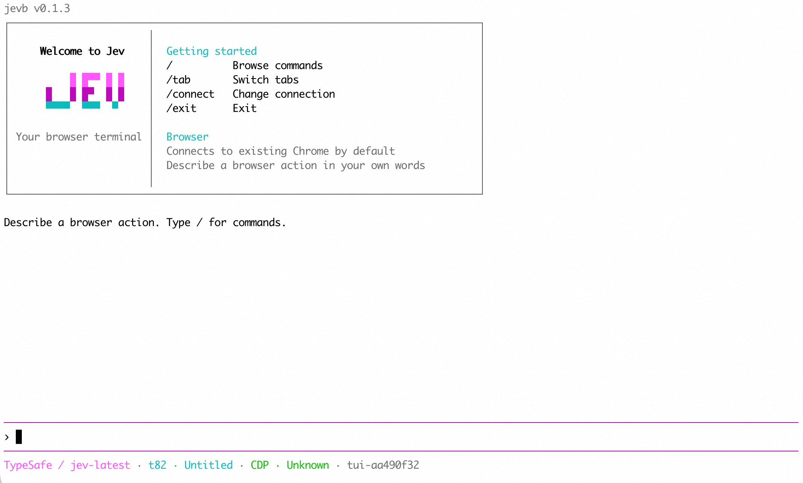

# jev-browser

在交互终端中用自然语言操作浏览器，也可通过结构化 CLI 命令供 AI Agent 调用。

[English](README.md) | 简体中文

## 1. 安装

需要 Node.js 22+。预编译包支持 macOS Apple Silicon；其他平台需按[本地开发](#4-本地开发)从源码构建。

```bash
npm install -g jev-browser-cli
```

安装后使用 `jevb`，也可使用等价的 `jev-browser`。首次打开页面时会查找 Chrome，缺少时自动下载。

### 复制给 Agent

将下面的提示词粘贴给编程 Agent，让它安装 CLI 和配套 Skill：

```text
执行 `npm install -g jev-browser-cli` 安装 jev-browser CLI，
再执行 `npx skills add Mrlyk/jev-browser --skill jev-browser` 安装配套 Skill，
并选择你当前使用的 Agent。读取 Skill：
https://github.com/Mrlyk/jev-browser/blob/master/skills/jev-browser/SKILL.md
之后在本项目的浏览器任务中使用这个 Skill。
```

## 2. 配置模型

直接运行 `jevb`。未配置 Key 时会进入登录流程，输入 TypeSafe 或 OpenRouter API Key 后自动进入交互终端；输入内容不会回显。也可单独登录：

```bash
jevb auth login
jevb auth status
```

CI 可通过 `TYPESAFE_API_KEY` 或 `OPENROUTER_API_KEY` 配置，例如：

```bash
export TYPESAFE_API_KEY="你的 API Key"
```

同一提供方优先使用环境变量；两家都有 Key 时优先 TypeSafe。非交互登录、退出和凭据管理见[认证指南](skills/jev-browser/references/sessions-auth.md#model-api-keys)。

## 3. 使用命令

### 交互终端

```bash
jevb
```



默认连接已有 Chrome，在 `chrome://inspect/#remote-debugging` 开启远程调试，并允许连接。

```bash
jevb tui --headed                     # 新建有头浏览器
jevb tui --headless                   # 新建无头浏览器
jevb tui --session demo               # 复用已有会话
jevb tui --cdp 9222                   # 连接指定浏览器
jevb tui --auto-connect               # 连接本机 Chrome
jevb tui --model-provider openrouter  # 指定模型提供方
```

| 命令 | 用途 |
| --- | --- |
| `/back`、`/go`、`/reload` | 后退、前进、刷新 |
| `/up [px]`、`/down [px]`、`/top`、`/bottom` | 滚动页面 |
| `/open <url>`、`/new [url]` | 打开页面、新建标签页 |
| `/tab`、`/tab <id>`、`/close [id]` | 选择、切换、关闭标签页 |
| `/provider auto\|typesafe\|openrouter` | 切换本次会话的模型提供方 |
| `/connect` | 选择已有 Chrome、CDP、有头、无头或已有会话 |
| `/status` | 查看会话和连接统计 |
| `/clear`、`/reset` | 清理显示、重置操作上下文 |
| `/help`、`/exit` | 查看命令、退出 |

`/connect auto` 连接已有 Chrome，`/connect headed`、`/connect headless` 新建浏览器，`/connect cdp 9222` 连接指定地址。切换连接保留原浏览器。

操作标签页绑定到会话，通过 `/tab` 切换。`/exit` 保留浏览器，按退出时打印的命令重新连接；`/exit --close` 同时关闭本次交互创建的浏览器。


### Agent 与脚本命令

```bash
jevb page open demo https://www.baidu.com --headed
jevb page act demo "搜索 jev"
jevb page snapshot demo
jevb session close demo
```

`demo` 是会话名，放在动作后；连续操作使用同一个名字。`--headed` 显示浏览器窗口。

浏览器操作的格式为 `jevb <资源> <动作> <会话名> [对象] [选项]`。`auth login`、`session list` 等公共命令不需要会话名。

`page act` 接收自然语言；已知网址、选择器或按键时，可以直接使用 `page open`、`element click`、`keyboard press` 等命令，省去模型判断。

一次 `page act` 执行一项操作，搜索可包含输入和回车。其他多步任务分开调用；用自然语言打开网站时需要完整 URL。

页面候选较多时自动分批判断，每批最多 253 个目标，另外保留无匹配和歧义选项。各批前两名进入统一比较，最终选择概率最高的目标；不够确定时仍需确认。请求还会按输入大小拆分，单个目标或公共上下文过大时可用 `--scope` 缩小范围。

### 常用命令

表内的选择器和标签页 ID 需按实际页面替换。参数详情可用 `jevb <资源> <动作> --help` 查看。

| 命令 | 用途 | 示例 |
| --- | --- | --- |
| `page open` | 打开网页 | `jevb page open demo https://www.baidu.com --headed` |
| `page act` | 执行自然语言指令 | `jevb page act demo "搜索 jev"` |
| `page snapshot` | 查看页面元素及引用 | `jevb page snapshot demo --json` |
| `page get` | 读取页面信息 | `jevb page get demo title` |
| `page wait` | 等待页面出现指定内容 | `jevb page wait demo --text "已完成"` |
| `element click` | 点击元素 | `jevb element click demo '#submit'` |
| `element fill` | 清空后填写 | `jevb element fill demo '#name' '张三'` |
| `element type` | 在末尾追加文字 | `jevb element type demo '#name' '先生'` |
| `keyboard press` | 按键 | `jevb keyboard press demo Enter` |
| `tab list` | 查看标签页 | `jevb tab list demo` |
| `tab switch` | 切换标签页 | `jevb tab switch demo t2` |
| `page screenshot` | 保存截图 | `jevb page screenshot demo page.png` |
| `console errors` | 查看页面错误 | `jevb console errors demo` |
| `session list` | 查看运行中的会话 | `jevb session list` |
| `session inspect` | 查看会话详情 | `jevb session inspect demo` |
| `session close` | 关闭指定会话 | `jevb session close demo` |
| `session clear` | 一次关闭全部运行中的会话 | `jevb session clear` |
| `browser connect` | 连接已开启调试端口的浏览器 | `jevb browser connect demo 9222` |
| `state save` | 保存登录状态 | `jevb state save demo auth.json` |

完整命令分组见 `jevb --help`。更多示例见[命令指南](skills/jev-browser/references/commands.md)，页面引用和会话复用见[快照指南](skills/jev-browser/references/snapshot-refs.md)、[会话指南](skills/jev-browser/references/sessions-auth.md)。

### 浏览器连接参数

| 参数 | 作用 | 示例 |
| --- | --- | --- |
| `--auto-connect` | 自动连接已开启远程调试的本机 Chrome，复用标签页和登录状态 | `jevb tab list mychrome --auto-connect` |
| `--cdp <port\|url>` | 连接指定调试端口或 CDP 地址，与 `--auto-connect` 二选一 | `jevb page snapshot mychrome --cdp 9222` |
| `--pin-tab` | 绑定当前标签页，并跟随它打开的子标签页；其他页面不会抢走绑定 | `jevb page snapshot mychrome --auto-connect --pin-tab` |
| `--no-pin-tab` | 取消固定标签页 | `jevb page snapshot mychrome --auto-connect --no-pin-tab` |
| `--headed` | 启动本地浏览器时显示窗口；连接已有浏览器无需此参数 | `jevb page open demo https://example.com --headed` |
| `--json` | 以 JSON 输出操作结果，便于脚本读取 | `jevb tab list mychrome --auto-connect --json` |

连接日常使用的 Chrome（144+）时，先在地址栏打开 `chrome://inspect/#remote-debugging` 并启用远程调试。`--auto-connect` 会保持连接并等待你响应 Chrome 的授权弹窗，允许后继续执行；没有授权倒计时，可以按 `Ctrl+C` 取消：

```bash
jevb tab list mychrome --auto-connect
jevb tab switch mychrome t2 --auto-connect
jevb page snapshot mychrome --auto-connect --pin-tab
jevb page act mychrome "搜索 jev" --auto-connect --pin-tab
```

将 `t2` 替换为列表中的目标标签页 ID，后续保持同一会话名。以上参数也可通过 `jevb help`、`jevb help browser connect`、`jevb help page act` 或 `jevb help tab list` 查看。

点击当前绑定页的链接打开新标签页时，会话自动跟随新页，后续命令继续操作该页。直接用 `tab create` 创建标签页也会切换绑定。手动切到其他已有标签页时，使用 `tab switch` 明确选择。绑定页关闭后，`jevb page act demo "打开百度"` 这类打开网页操作会新建标签页；点击、填写仍需重新选择页面。`session clear` 会清除全部会话的标签页绑定，包括已退出的会话。

### 指定动作和输入内容

```bash
jevb page act demo --op fill '姓名输入框' --value '张三'
printf '%s' "$TEST_PASSWORD" | jevb page act demo --op fill '密码输入框' --value-stdin
```

`--op fill` 清空后填写，`--op type` 追加，两者都不会自动回车。通过 `--value` 或标准输入提供的内容不发送给模型，也不回显。

## 4. 本地开发

需要 Node.js 22+ 和 Rust stable。在仓库根目录运行：

```bash
npm run dev
```

自动安装依赖、构建并将 `jevb` 和 `jev-browser` 链接到当前仓库，之后可在任意目录测试。修改源码后重跑此命令。

恢复正式版时，使用同一套 Node/npm 安装，会覆盖开发链接并保留源码：

```bash
npm install -g jev-browser-cli@latest
```

功能回归使用 `npm test`。终端测试需要 macOS 或 Linux 及 Python 3；浏览器测试需连接专用 CDP 浏览器，`test:live`、`test:tui:live` 还需配置模型 Key。

```bash
npm run test:tui
npm run test:connections
JEV_TEST_CDP=9222 npm run test:smoke
JEV_TEST_CDP=9222 npm run test:tui:live
```

打包或发布：

```bash
node scripts/licenses.mjs
npm pack
npm run publish -- --dry-run  # 预览发布
npm run publish              # 发布到 npm，需要发布权限
```

模型调用耗时、费用和测试覆盖见[验证记录](VALIDATION.md)。

## 5. 开源协议

采用 [Apache-2.0](LICENSE)。浏览器执行能力基于 [agent-browser](https://github.com/vercel-labs/agent-browser)，源码版本与授权见 [UPSTREAM.json](UPSTREAM.json)、[THIRD_PARTY_NOTICES.md](THIRD_PARTY_NOTICES.md)。
